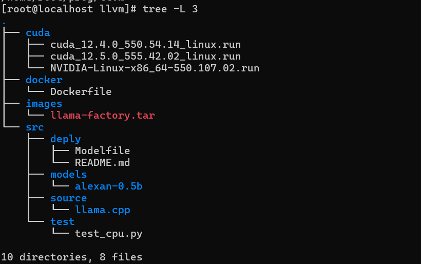

### 1. requirements
- 可以科学上网

### 2. 如何计算模型需要多少GPU内存
```math
M = (P * 4B)/(32/Q) * 1.2
```

| Field | explain                                  |
| ----- | ---------------------------------------- |
| M     | GPU内存(以Gigabyte为单位)                |
| P     | 模型中的参数数量。eg，7B模型有70亿个参数 |
| 4B    | 4个字节，表示每个参数使用的字节数        |
| 32    | 每个字节有32(bit)                        |
| Q     | 加载模型时使用的位数，4，8或者16位       |
| 1.2   | 表示内存加载过程中额外的消耗             |

### 3. llamafactory训练流程
- 宿主机操作系统
  - Anolis8.9

    Centos8 or redhat8

- 物理机安装nvidia驱动和cuda环境

  - 安装podman
  
    使用podman不推荐docker原因, podman采用CDI支持容器访问nvidia的GPU驱动,
    而docker还是采用老旧的running time架构访问宿主机gpu驱动.
 
    ```bash
    dnf install -y docker
    systemctl start podman
    systemctl enable podman
    ```

  - 安装nvidia驱动和cuda环境
  
    - 下载nvidia驱动和cuda到nvidia目录下

    ```bash
    mkdir nvidia
    wget https://cn.download.nvidia.com/XFree86/Linux-x86_64/550.107.02/NVIDIA-Linux-x86_64-550.107.02.run
    wget https://developer.download.nvidia.com/compute/cuda/12.4.0/local_installers/cuda_12.4.0_550.54.14_linux.run
    ```
 
    - 安装nvidia驱动和cuda

    ```bash
    bash NVIDIA-Linux-x86_64-550.107.02.run
    bash cuda_12.4.0_550.54.14_linux.run
  
    # 配置root环境变量访问cuda
    echo 'export PATH=/usr/local/cuda/bin:$PATH' >> ~/.bashrc
    echo 'export LD_LIBRARY_PATH=/usr/local/cuda/lib64:$LD_LIBRARY_PATH' >> ~/.bashrc
    source ~/.bashrc
    ```
  
    - 验证nvidia驱动和cuda

    ```bash
    nvidia-smi
    nvcc --version
    ```

  - 安装nvidia CDI环境

    默认podman不支持直接访问物理机设备, 事实上也是支持的, 只不过你需要手动指定所有库和device.
    为了方便我们直接使用CDI标准, 让容器来通过配置文件访问物理机的device.
 
    - 配置dnf库
    
    ```bash
    curl -s -L https://nvidia.github.io/libnvidia-container/stable/rpm/nvidia-container-toolkit.repo | \
    tee /etc/yum.repos.d/nvidia-container-toolkit.repo
    ```

    - 安装nvidia-container-toolkit

    ```bash
    yum-config-manager --enable nvidia-container-toolkit-experimental
    dnf install -y nvidia-container-toolkit
    ```

    - 宿主机中生成CDI设备
  
    ```bash
     nvidia-ctk cdi generate --output=/etc/cdi/nvidia.yaml
    ```

    - 检查生成的设备的名称
  
    ```bash
    nvidia-ctk cdi list
    ```

    - 测试是否可以在容器内访问宿主机的nvidia驱动

    ```bash
    podman run --rm --device nvidia.com/gpu=all --security-opt=label=disable ubuntu nvidia-smi
    ```

  - 根据nvidia基础镜像制作image

    docker镜像需要安装llamafactory环境

    docker镜像中只需要安装cuda环境即可，要求<=物理机的cuda

    docker build编译LLammfactory镜像
    事实上, 强烈建议使用nvidia的基础镜像, 在上面修改镜像
    进入docker目录, 执行

    ```bash
    docker build -t alexan/llamafactory .
    ```

  - 测试是否在docker中可以使用gpu

    容器内

    ```python
    import torch
    torch.cuda.current_device()
    torch.cuda.get_device_name(0)
    torch.__version__
    ```

    容器外

    ```bash
    podman run --rm --device nvidia.com/gpu=all localhost/alexan/llamafactory:latest nvidia-smi
    ```

  - podman运行gpu容器

  ```bash
  # 把外部源码目录映射到容器内
  podman run -ti --device nvidia.com/gpu=all --network host -v /home/root/prog/llvm/:/opt/llvm localhost/alexan/llamafactory:latest bash
  ```

  - 宿主机项目目录介绍
  
  

    - docker

      存放Dockerfile文件
  
    - src/deply
    
      存放模型的modefile文件
 
    - src/models

      存放生成的模型

    - src/sources

      存放llama.cpp, 用于进行模型合并的源码

    - src/test

      容器内测试cuda的脚本(这里名字写错了)
  

- 下面都是容器内操作

- 配置LLamafactory环境和训练模型

  - 安装环境
    如果镜像制作好了, 这里可以skip.    

    ```bash
    git clone --depth 1 https://github.com/hiyouga/LLaMA-Factory.git
    cd LLaMA-Factory
    pip install -e ".[torch,metrics]"
    ```

  - 注册数据集

    这里建议使用python3处理数据

    - 在LLamafactory/data目录下创建数据集

      要符合格式alexan_en_demo.json

      ```bash
      [
        {
          "instruction": "Describe a process of making crepes.",
          "input": "",
          "output": "Making crepes is an easy and delicious process! Here are step-by-step instructions on how to make them:\n\n1. Assemble your ingredients. For basic crepes, you'll need: 1 cup all-purpose flour, 2 eggs, 1/2 cup milk, 1/2 cup water, 1/4 teaspoon salt, and 2 tablespoons melted butter.\n\n2. Mix the batter: In a large mixing bowl, whisk together the flour and the eggs. Gradually add the milk and water, stirring constantly to ensure that there are no lumps. Add salt and melted butter, and mix well.\n\n3. Let the batter rest: If you can, let the batter sit for an hour or so. This will help the flour to absorb the liquid and make the crepes more tender.\n\n4. Heat your pan: Preheat a non-stick pan over medium heat. Lightly butter the pan or use cooking spray to prevent the crepes from sticking.\n\n5. Pour the batter: Using a ladle or a measuring cup, pour a small amount of batter (about 1/4 cup) onto the center of the pan. Immediately tilt the pan in a circular motion to spread the batter evenly and thinly over the bottom of the pan.\n\n6. Cook the crepe: Cook the crepe for 1-2 minutes until the bottom is lightly golden. Carefully loosen the edges with a spatula and flip the crepe over to cook the other side for another minute.\n\n7. Remove and repeat: Gently slide the crepe onto a plate, and then repeat the process with the remaining batter. Remember to re-butter the pan between each crepe if necessary.\n\n8. Fill and serve: Fill your cooked crepes with your desired filling, such as fresh fruit, whipped cream, Nutella, or ham and cheese. Roll or fold, and serve immediately. Enjoy!"
        },
        {
          "instruction": "Transform the following sentence using a synonym: The car sped quickly.",
          "input": "",
          "output": "The car accelerated rapidly."
        },
        {
          "instruction": "Make a persuasive argument to promote recycling.",
          "input": "",
          "output": "Recycling is an incredibly important action that we must all take to help preserve our planet for future generations. By recycling, we can reduce the amount of waste that goes to landfills, conserve natural resources and energy, and reduce pollution from production of new materials.\n\nWhen we don't recycle, our garbage ends up in landfills where it can take hundreds of years to decompose. Landfills can release harmful chemicals and greenhouse gases, polluting the soil, air and water. However, by recycling and reusing materials, we minimize the amount of garbage that ends up in landfills, and therefore reduce the potential harm it can cause to the environment.\n\nRecycling also helps conserve our natural resources by reducing the demand for new materials. For example, recycling paper means fewer trees need to be cut down, and reusing metal and plastic means less mining and oil extraction. This, in turn, conserves energy, minimizes deforestation and reduces the environmental impact associated with producing new materials.\n\nAdditionally, recycling also has a positive impact on the economy. It creates jobs in the recycling and manufacturing industries, and reduces the costs of waste disposal for companies and taxpayers. Recycling is good for the environment and the economy.\n\nIn conclusion, recycling is an easy and effective way to take action and make a difference for the future of our planet. By simply separating our recyclable materials and disposing of them properly, we can help reduce waste, conserve resources, and protect the environment. We all have a part to play and every little action counts. So, let's make the smart choice and recycle today for a better tomorrow."
        }
      ]
      ```

    - 编辑llamafactory/data目录下的dataset_info.json文件

      追加注册的文件

      ```bash
      "alexan_en_demo": {
      "file_name": "alexan_en_demo.json"
      },
      ```

  - 选择模型

  - 微调训练(lora)

    webui操作

  - 模型导出

    webui操作，需要绑定训练后的结果

  - 合并模型

    ```bash
    git clone https://github.com/ggerganov/llama.cpp.git
    
    # 合并模型
    python3 convert_hf_to_gguf.py --outfile /opt/llvm/src/models/alexan-0.5b/alexan-0.5b.gguf /opt/llvm/src/models/alexan-0.5b/
    
    # llamafactory-cli export merge_config.yaml
    ```

  - 量化模型

    进入llama.cpp目录

    ```bash
    mkdir build
    cmake ..
    cmake --build . --config Release
    ```

    然后执行量化操作

    ```bash
    
    ```

- ollama部署模型

  安装ollama, 如果容器制作好了, 可以skip

  ```bash
  curl -fsSL https://ollama.com/install.sh | sh
  ```

  启动ollama serve

  ```bash
  ollama serve
  ```

  注册模型

  - 编辑alexan-0.5b.modelfile文件

    ```bash
    FROM /opt/llvm/src/models/alexan-0.5b/alexan-0.5b.gguf
    ```

  - 注册模型

    ```bash
    ollama create alexan-0.5b -f alexan-0.5b.modelfile
    ```

  部署模型

  ```bash
  ollama run alexan-0.5b:latest
  ```

- openwebui显示web模型

  最好使用另一个容器

  ```bash
  docker pull swr.cn-north-4.myhuaweicloud.com/ddn-k8s/ghcr.io/open-webui/open-webui:v0.3.12
  docker run -d -p 3000:8080 --add-host=host.docker.internal:host-gateway -v open-webui:/opt/llvm/app/backend/data --name open-webui swr.cn-north-4.myhuaweicloud.com/ddn-k8s/ghcr.io/open-webui/open-webui:v0.3.12
  ```

### 3. refer

[nvidia install cdi](https://docs.nvidia.com/datacenter/cloud-native/container-toolkit/latest/install-guide.html#installing-with-yum-or-dnf)

📝License💖

